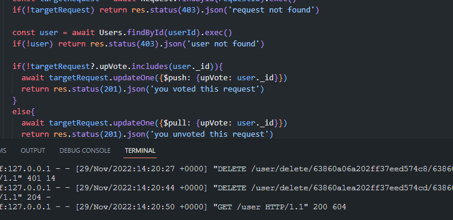

# SONG REACTION REQUEST API
> ### A song reaction request website API. This is a reaction request Api, where users can make a request on the song they wish the content creator to make a reaction to.

---

>_Javascript_ (**NODE.JS**)

**_FEATURES_**
* [x] Register new user by email
* [x] Create a song request
* [x] Edit a song request
* [x] Get all song requests with user details
* [x] Get all completed song requests
* [x] Delete a song request by _USER_ or _ADMIN_
* [x] Toggle _vote_ for a made request
* [x] Toggle _completed_ a made request

---

> *image preview*

